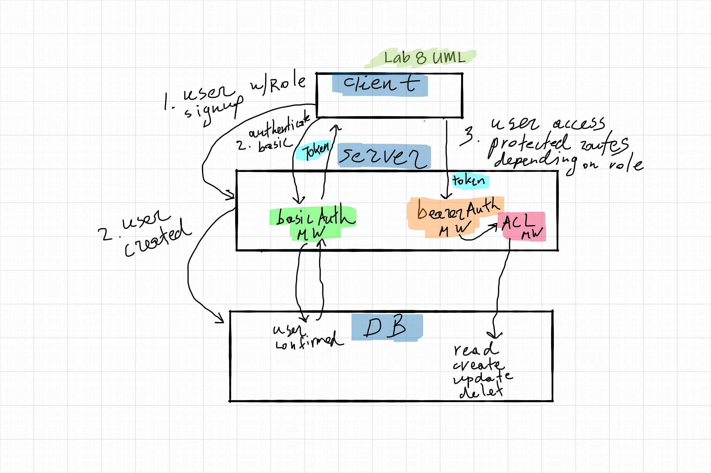

# LAB 8: Access Control

## Description

**Authentication Server Phase 3:** Role Based Access Control

In this lab, we implement Role Based Access Control (RBAC) using an Access Control List (ACL), allowing to not only restrict access to routes for valid users, but also based on the individual permissions we give each user.

## Author

Ayrat Gimranov

## Collaborators

Charlie Fadness

## Version

1.0.0

## Resources

Code Feloows 401: JS starter code (https://github.com/codefellows/seattle-javascript-401n19/tree/main/class-08/lab/starter-code)

## Deployed Sites

Prod branch -- https://ayrat-server-deploy-prod.herokuapp.com/
Dev branch -- https://ayrat-server-deploy-dev.herokuapp.com/

## UML

;
